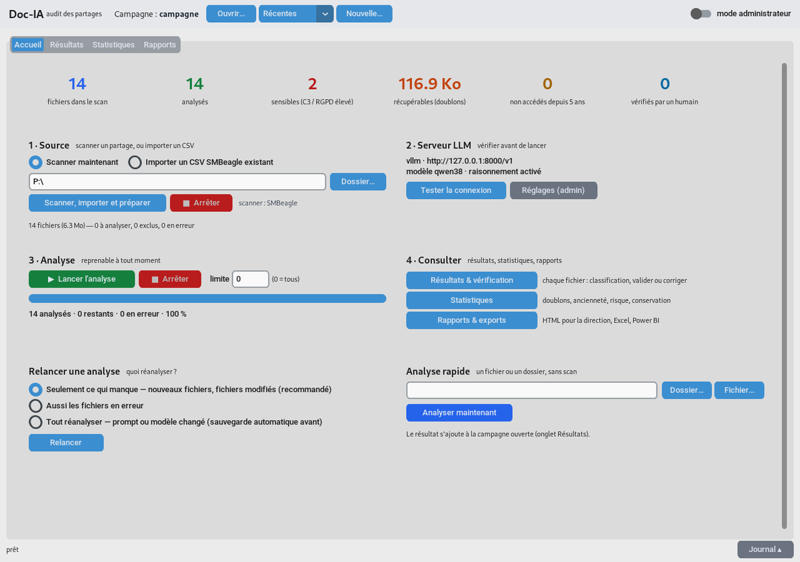

# Doc-IA analyzer (`docia`)

Audit du contenu d'un partage de fichiers par une **LLM locale** (rien ne quitte l'organisme).
Pour chaque fichier : **sensibilité (C0–C3)**, **données personnelles (RGPD)**, **finance**,
**juridique**, **durée de conservation** — plus l'hygiène du partage : **doublons (espace
récupérable)**, **fichiers non accédés depuis N ans**, **candidats au nettoyage**. Restitution :
interface graphique, rapport HTML pour la direction, classeur Excel, CSV pour Power BI Report Server.

📖 **[Guide de l'utilisateur illustré](docs/GUIDE_UTILISATEUR.md)** — installation, les 4 étapes,
lecture des résultats, vérification humaine, FAQ.



## Installation sur un poste Windows (utilisateur)

1. Copier dans un même dossier : **`Docia.exe`** (artefact `Docia-windows-x64` de la
   [CI](../../actions)) et **`SMBeagle.exe`** (artefact `windows-x64` de la
   [CI de smbeagle_enriched](https://github.com/Martossien/smbeagle_enriched/actions) — prenez
   celui du dernier commit de `main` : la dernière release publiée, **v4.2.0 du 30/08**, scanne
   encore le mauvais dossier quand le chemin est mal formé au lieu de le refuser en code 2,
   écrit une taille de `0` quand elle n'a pas été collectée — ce qui vide la campagne en
   silence — et rend `0` sur un partage fermé par ACL, présentant un périmètre amputé comme
   complet. Vérifié le 01/09.)
2. Lancer `Docia.exe` (double-clic = interface ; en console, `Docia.exe doctor` vérifie que tout
   est en place : DocFuse, pdfium, **OCR Tesseract embarqué** — rien d'autre à installer, ni .NET
   ni Tesseract). Le diagnostic fait un **vrai essai d'OCR** et affiche, en cas d'échec, le
   message de Tesseract lui-même ; il est aussi accessible sans console (mode administrateur →
   *Serveur & performances* → **Diagnostic du poste**).
3. Mode administrateur (interrupteur en haut à droite) → *Serveur & performances* : adresse du
   serveur LLM, **Tester la connexion**, Enregistrer.

Un fichier **`docia.log`** est tenu à côté de `Docia.exe` (rotation 4 Mo × 4) : la console garde
une ligne par incident, le détail complet — y compris ce que l'écran ne montre pas — y est écrit.
C'est le fichier à joindre en cas de souci. Hors exécutable empaqueté (`pip install docia`), il est
écrit à côté du `docia.toml` désigné par `--config`. Si une autre instance le tient ouvert, Doc-IA
bascule sur `docia-<pid>.log` au même endroit plutôt que de perdre le journal.

Le mode de scan standard est le **scan local Windows** : un lecteur réseau mappé (`P:\`) ou un
dossier (`\\serveur\partage\Finance`), avec le compte de la session (droit de lecture suffisant).

## Principe

```
SMBeagle.exe (scan local Win32, piloté par docia) ──▶ CSV 19 colonnes + manifeste
        │ docia scan : import + préparation (exclusions, priorité)
        ▼
SQLite « campagne » (un fichier .sqlite par périmètre audité)
        │ docia run (reprenable ; rescan = seulement les fichiers modifiés)
        ▼
DocFuse (bibliothèque, sur le poste) : extraction + OCR + blocs ≤ N tokens
        │ seul du TEXTE part vers le serveur, jamais les documents
        ▼
LLM locale (vLLM direct, ou open-webui natif) ── JSON garanti par json_schema
        │ comptage exact /tokenize avant envoi ; gros fichiers en segments complets agrégés
        ▼
SQLite (analyses, revues humaines) ──▶ GUI · rapport HTML · Excel · Power BI · CSV/JSON
```

- **Reprise partout** : une analyse est liée au contenu du fichier, au prompt et au modèle ;
  relancer ne refait que ce qui manque. Les doublons exacts héritent de l'analyse de l'original.
- **Jamais tronqué, jamais « trop long »** : les très gros fichiers sont découpés en segments
  complets puis agrégés ; chaque bloc est compté exactement par le serveur avant envoi et
  re-découpé au besoin dans le même run.
- **Dates d'accès honnêtes** : l'ancienneté (« non accédé depuis N ans ») s'appuie sur la première
  date observée — l'audit lui-même (hachage, OCR, extraction) ne « rajeunit » pas les fichiers.
- **Raisonnement (thinking)** activé par défaut, effort `medium`, budget **imposé** (6 000 tokens)
  — réglages mesurés sur banc, modifiables dans l'onglet Serveur.
- **Mémoire bornée à l'extraction** : un lot est fermé au cumul des tailles (`blocks.batch_bytes`,
  64 Mio par défaut), pas seulement au nombre de fichiers — 360 Mo de pic au lieu de 2 135 Mo sur
  600 Mo de gros fichiers, à durée identique (mesure du 01/09).

### Ce qui est écrit sur le disque du poste

Pour interroger la LLM, Doc-IA écrit des **blocs** `.md` dans `<campagne>.blocks/` (à côté du
`.sqlite` ; réglage `blocks.work_dir`). **Ces fichiers contiennent le texte intégral des documents
analysés, en clair** — OCR compris, donc potentiellement des données de santé, des bulletins de
paie ou des identifiants — avec les droits du dossier parent. Par défaut (`blocks.keep_blocks =
true`) ils sont **conservés indéfiniment** : ils servent à reprendre une analyse interrompue sans
tout réextraire et à vérifier ce qui a été soumis à la LLM. Pour ne pas les garder, mettre
`keep_blocks = false` (chaque bloc est effacé dès qu'il est traité) ; pour les faire disparaître
après coup, supprimer le dossier `<campagne>.blocks/` — les analyses, elles, sont dans le
`.sqlite`. Détail et recommandation RSSI : [guide, §8](docs/GUIDE_UTILISATEUR.md#où-est-le-texte-des-documents--à-lire-avant-le-premier-audit).

## Ligne de commande

```bash
docia init                          # écrit docia.toml (config commentée)
docia doctor                        # état du poste : DocFuse, pdfium, OCR, scanner, serveur
docia scan --local-path "P:\\"      # étape 0 : scanner → import → préparation (SMBeagle piloté)
docia ingest scan.csv               # ou : import d'un CSV SMBeagle déjà produit (19 colonnes)
docia run --limit 500               # blocs DocFuse → LLM → analyses (reprend où il s'était arrêté)
docia status                        # compteurs par statut, blocs, classifications
docia report --format html          # rapport autonome (hygiène + risque + conservation)
docia export --format csv|json|xlsx|powerbi -o SORTIE
docia quick DOSSIER                 # analyse immédiate d'un fichier/dossier, sans scan
docia prompt list|show|save|use     # le prompt est une variable : profils nommés en base
docia review ID --status validated  # vérification humaine (validé / corrigé + commentaire)
docia reanalyze --scope errors|all|filter [--where security=C3]
docia backup [--out DIR]            # sauvegarde horodatée (<base>.backups/, rotation 10)
docia restore SAUVEGARDE.sqlite     # restauration (l'actuelle est d'abord sauvegardée)
                                    # les copies « avant_* » (migration, restauration, réanalyse)
                                    # sont listées mais jamais tournées : à supprimer à la main
docia campaigns                     # campagnes récentes et leur avancement
docia retry                         # remet les fichiers en erreur à « à analyser »
docia bench                         # vitesse de la LLM : prefill/decode, raisonnement, fichiers/heure
docia gui                           # interface (aussi : double-clic sur Docia.exe)
```

Toutes ces opérations passent par la couche **`docia.service`** (campagnes, événements de
progression avec temps restant, réanalyse, sauvegardes) — la même que l'interface et, demain,
le serveur web de pilotage à distance (v4).

## Serveur LLM

Référence : vLLM + Qwen3.8-27B, contexte natif 262 144, structured outputs xgrammar,
`--reasoning-parser qwen3` (budget de raisonnement imposé par requête) — script
`~/Doc-IA/bench_vllm/serve_qwen38.sh`. Alternative : open-webui ≥ 0.11 en API native
(`transport = "openwebui"`, `base_url = "http://serveur:8080/api"`, clé `sk-`) — dans ce mode le
budget de raisonnement n'est pas relayé, seul le renvoi à budget doublé protège.

## Qualité

- `scripts/check.sh` : ruff + mypy strict + pytest (579 tests), **VERDICT** explicite — rien n'est
  poussé sans `VERDICT: OK`. Les tests qui exigent un vrai écran (`tests/test_gui_ecran.py`,
  marque `screen`) sont en plus, joués à la main **sur un affichage dédié**, jamais sur
  la session graphique en cours : `DISPLAY=:99 DOCIA_GUI_SCREEN=1 pytest
  tests/test_gui_ecran.py` (voir l'en-tête du fichier pour ouvrir cet affichage).
- CI GitHub (Ubuntu + Windows) : lint/tests 3.11–3.13, build de `Docia.exe` (PyInstaller,
  bibliothèques des extracteurs et **Tesseract embarqués**), puis l'exe est **exécuté** sur le
  runner : `doctor`, extraction réelle de 11 formats bureautiques, **OCR d'un PDF scanné généré**
  (Tesseract retiré du PATH), ouverture/fermeture de l'interface.
- `scripts/e2e_local.sh` : test complet sur la machine de développement (scanner → OCR → vLLM →
  base → rapports, 28 vérifications automatiques — 28/28 au 01/09).

Référence de tous les réglages : [`docs/REGLAGES.md`](docs/REGLAGES.md).
Conception détaillée : [`docs/DESIGN_V3.md`](docs/DESIGN_V3.md) (§13 budget de raisonnement,
§14 étape scanner, §15 comptage exact). POC d'origine (2025) : dossier `legacy/`, à retirer (voir `AGENTS.md` §7).

## Installation développeur

```bash
uv venv --python 3.11 .venv && uv pip install --python .venv/bin/python -e /chemin/DocFuse -e ".[dev,gui]"
bash scripts/check.sh        # doit finir par VERDICT: OK
```

Python ≥ 3.11. Dépendances cœur : `docfuse` ≥ 0.2.0, `httpx`. Licence Apache 2.0.
