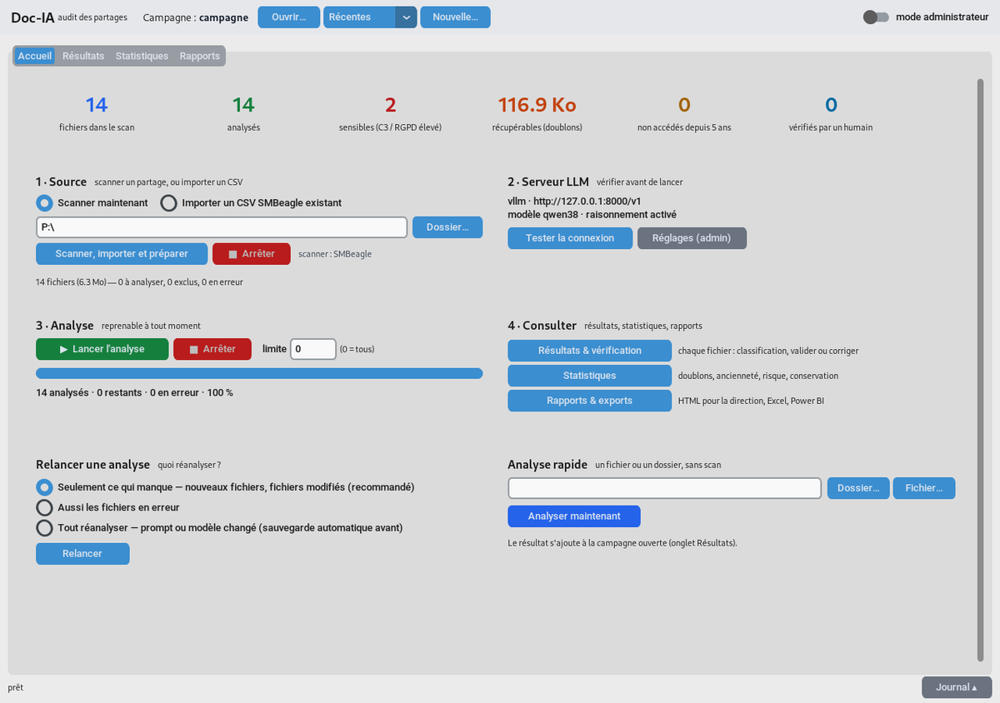
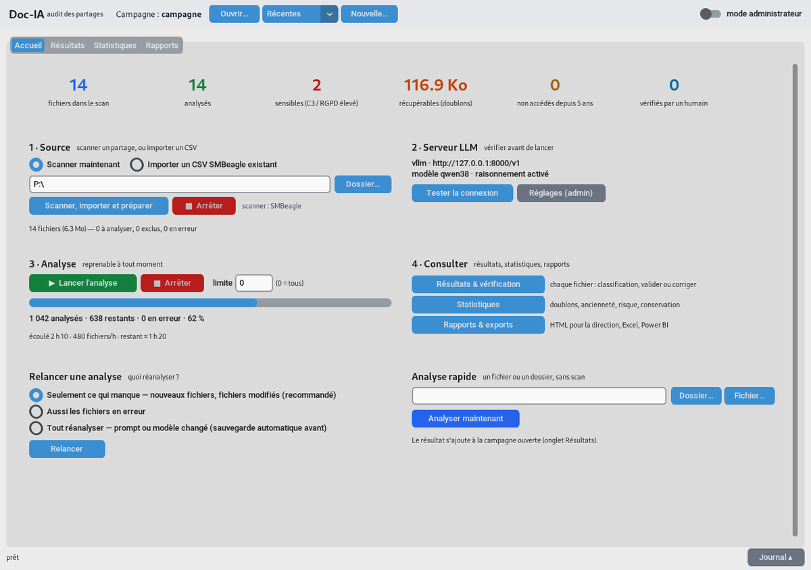
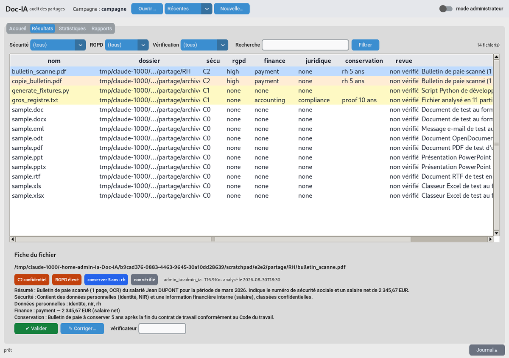
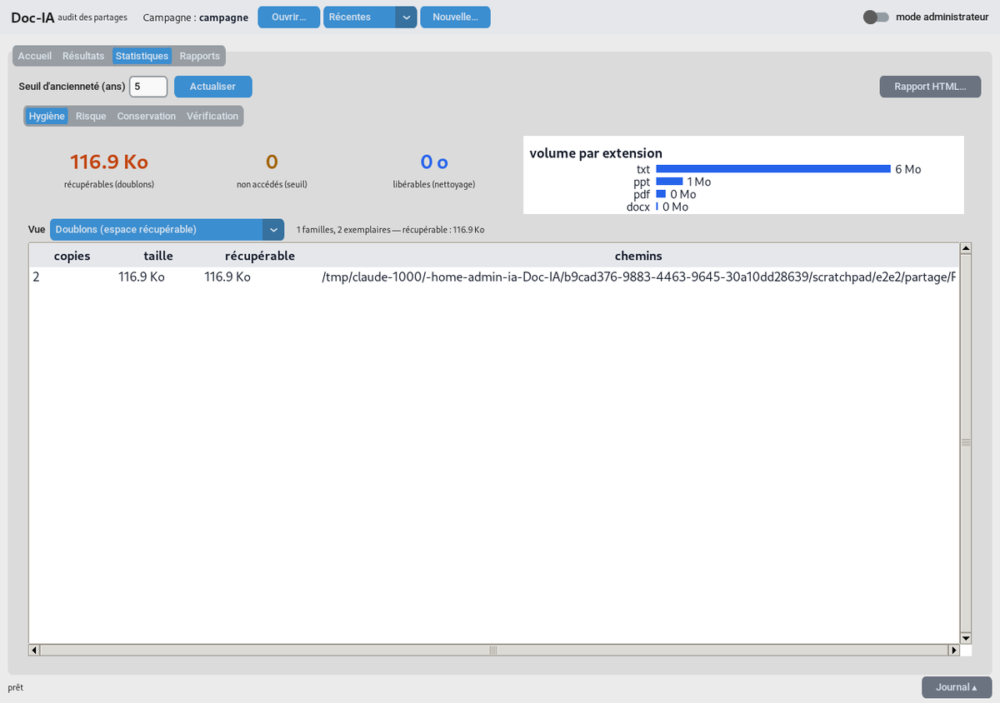
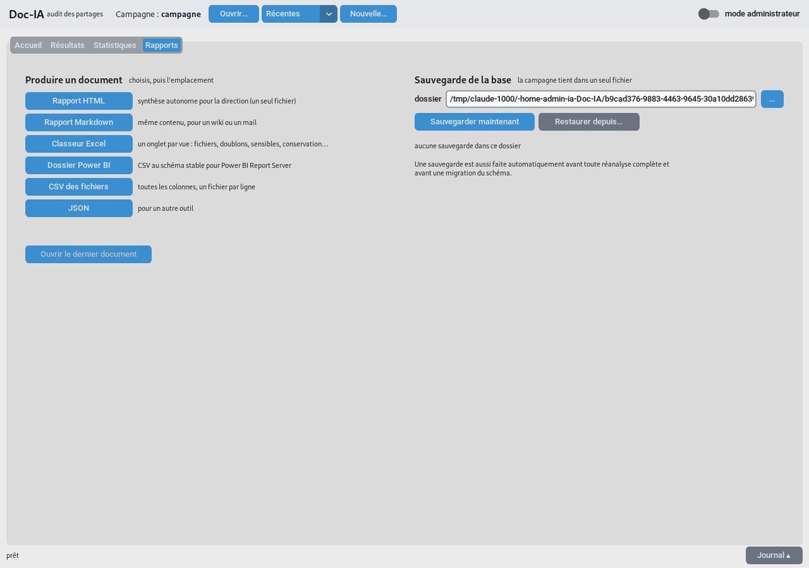
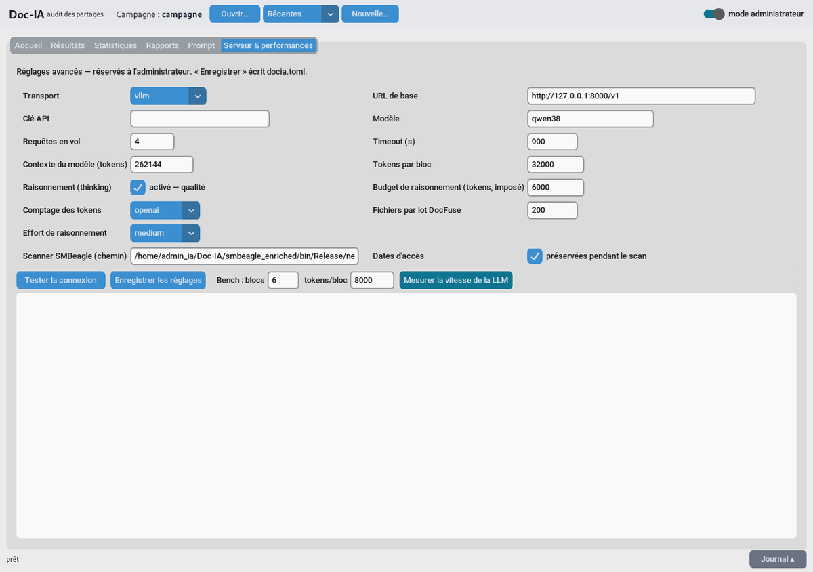

# Doc-IA — guide de l'utilisateur

Doc-IA analyse le contenu des fichiers d'un partage réseau avec une IA locale (rien ne sort de
l'organisme) et vous dit, fichier par fichier : **niveau de sensibilité**, **données personnelles
(RGPD)**, **documents financiers et juridiques**, **durée de conservation à respecter**. Il calcule
aussi ce qui encombre le partage : **doublons**, **fichiers non ouverts depuis des années**,
**fichiers libérables**. Tout est restitué dans l'interface, un rapport HTML pour la direction,
un classeur Excel et un jeu de fichiers pour Power BI.

> Vocabulaire : une **campagne** = un partage (ou un service) audité à une date donnée. Tout tient
> dans un seul fichier `.sqlite` que vous choisissez au départ ; vous pouvez le rouvrir, le
> sauvegarder, le relancer plus tard.

## Comment ça marche (en deux mots)

1. **Le scanner** inventorie les fichiers du lecteur (noms, tailles, dates, propriétaires,
   empreintes) — il ne lit que les en-têtes.
2. **Le poste extrait le texte** : Doc-IA ouvre chaque document (Word, Excel, PDF, mails…) ; les
   pages scannées passent par l'**OCR intégré**. Les textes sont regroupés en paquets.
3. **Seul ce texte part** vers le serveur IA de l'organisme (connexion directe au serveur GPU, par
   défaut) — **jamais les documents eux-mêmes**, et jamais vers l'extérieur.
4. L'IA renvoie pour chaque fichier une réponse structurée : résumé, sensibilité, RGPD, finance,
   juridique, conservation.
5. Doc-IA vérifie cette réponse et l'enregistre dans la campagne — c'est ce que montrent les
   onglets Résultats, Statistiques et Rapports, et ce que l'humain peut ensuite valider ou corriger.

Si l'analyse est interrompue (poste éteint, arrêt volontaire), rien n'est perdu : la relance
reprend au point exact. Un fichier déjà analysé n'est jamais renvoyé tant qu'il n'a pas changé.

## 1. Installation (poste Windows)

1. Copier dans un même dossier : `Docia.exe` et `SMBeagle.exe` (le scanner).
2. Double-cliquer sur `Docia.exe` : la fenêtre s'ouvre (une console reste derrière, c'est normal).
3. En bas à droite, **mode administrateur** → onglet *Serveur & performances* : l'administrateur
   renseigne l'adresse du serveur IA et clique **Tester la connexion**. Ce réglage est enregistré
   (`docia.toml`) — l'utilisateur n'a pas à y revenir.

L'OCR (lecture des PDF scannés, courriers et factures numérisés) est **intégré** à `Docia.exe` :
aucune installation. `Docia.exe doctor` (ligne de commande) vérifie que tout est en place — il
**fait un vrai essai d'OCR** sur une image fabriquée pour l'occasion et affiche `ocr_essai ok`.
En cas d'échec, il affiche le message de Tesseract lui-même, ce qui donne la cause exacte
(fichier de langue absent ou mis en quarantaine par l'antivirus, dossier `tessdata` inaccessible…).

Un fichier **`docia.log`** est tenu à côté de `Docia.exe` : la console ne montre qu'une ligne par
incident, le détail complet (pile d'appels, et les messages internes que l'écran ne montre pas)
va dans ce fichier, qui tourne automatiquement (4 Mo × 4). C'est ce fichier qu'il faut joindre
pour toute demande d'aide.

Deux précisions utiles :

- **Hors exécutable empaqueté** (Doc-IA installé avec `pip`), le journal est écrit à côté du
  fichier de configuration désigné par `--config`, et non à côté de l'exe — qui n'existe pas.
- Si `docia.log` est **déjà ouvert par une autre instance** (la fenêtre et un `Docia.exe scan` en
  parallèle, deux sessions RDS…), Doc-IA écrit dans `docia-<numéro de processus>.log` au même
  endroit. Et si la rotation devient impossible pour la même raison, elle est simplement
  abandonnée — le journal continue de grossir plutôt que de s'arrêter d'écrire.

## 2. Lancer un audit : quatre étapes

### Étape 1 · Source

Bandeau du haut → **Nouvelle…** : choisir où enregistrer la campagne (ex.
`Z:\audits\finance-2026.sqlite`). Le fichier est **créé aussitôt** : son nom s'affiche dans le
bandeau et le journal confirme « campagne créée : … ». Choisir un fichier de campagne existant
l'ouvre sans rien effacer.

Puis, carte **1 · Source**, deux possibilités :

- **Scanner maintenant** : indiquer le **lecteur réseau mappé** (ex. `P:\`) ou le dossier à
  auditer (ex. `\\serveur\partage\Finance`), puis **Scanner, importer et préparer**. C'est le
  mode standard : le scan passe par Windows, avec le compte de la session — il doit **lire** le
  partage. La progression s'affiche (fichiers vus) ; on peut **Arrêter** — ce qui a été vu est
  conservé. (Le mode « nom du serveur SMB » existe mais n'est pas utilisé pour l'audit.)
  Le chemin doit être **complet** : `D:\dossier`, `P:\`, `\\serveur\partage`. Un chemin
  relatif est refusé avec un message clair — il serait sinon cherché ailleurs que là où
  vous croyez. Un sous-dossier dont l'accès est refusé est signalé et ignoré : **l'audit
  continue** sur le reste du partage.
- **Importer un CSV SMBeagle existant** si un scan a déjà été fait ailleurs.

À la fin, la ligne d'état indique combien de fichiers seront analysés et combien sont exclus
(fichiers système, images, archives… exclus par règle, jamais par oubli).

### Étape 2 · Serveur IA

Le serveur IA est une machine dédiée (GPU) sur le réseau de l'organisme — son adresse est réglée
une fois par l'administrateur. **Tester la connexion** : ✔ vert = on peut lancer. Sinon, prévenir
l'administrateur (serveur éteint, port filtré, mauvaise adresse).

### Étape 3 · Analyse

**▶ Lancer l'analyse**. La barre indique l'avancement, la vitesse (fichiers/heure) et le temps
restant estimé. Vous pouvez fermer l'application ou **■ Arrêter** à tout moment : **rien n'est
perdu**, la relance reprend exactement où elle s'était arrêtée.

Les très gros fichiers sont lus en entier (par morceaux complets puis réunis), les doublons exacts
ne sont analysés qu'une fois, les PDF scannés passent par l'OCR — automatiquement.

### Étape 4 · Consulter

Les trois boutons ouvrent les onglets **Résultats**, **Statistiques**, **Rapports**.

## 3. Lire les résultats

Onglet **Résultats** : un tableau, une ligne par fichier, les plus sensibles en tête. Les couleurs
sont les mêmes partout (interface, rapport) :

| Sécurité | Signification |
|---|---|
| **C3 secret** (rouge) | identifiants, mots de passe, clés, données de santé, informations pouvant compromettre une personne ou la sécurité |
| **C2 confidentiel** (orange) | données personnelles, contrats, informations financières internes |
| **C1 interne** (jaune) | usage interne sans donnée sensible |
| **C0 public** (vert) | rien de sensible |

La colonne **rgpd** va de *aucune* à *critique* ; **conservation** indique la durée et le fondement
(preuve, légal, fiscal, RH, contractuel). Les filtres et la recherche réduisent la liste.

Cliquer une ligne ouvre la **fiche** : résumé en français, justification, données personnelles
repérées, montants, parties, conservation.

### Vérifier (rôle du relecteur)

Sous la fiche : **✔ Valider** si l'IA a raison, **✎ Corriger…** pour choisir la bonne classe (et un
commentaire), ou marquer *à vérifier*. Le compteur « vérifiés par un humain » de l'Accueil et
l'onglet *Statistiques → Vérification* suivent l'avancement de la relecture ; le rapport pour la
direction distingue ce qui a été vérifié.

## 4. Statistiques

Quatre sous-onglets :

- **Hygiène** : espace récupérable (doublons), fichiers non accédés depuis N ans, candidats au
  nettoyage, répartitions par extension / propriétaire / partage / répertoire / taille.
- **Risque** : C3 / C2, RGPD élevé, fichiers sensibles, classification croisée par partage,
  propriétaire ou répertoire.
- **Conservation** : le plan de conservation (fin, durée, fondement, échus).
- **Vérification** : validés / corrigés / à vérifier, écarts entre l'IA et le relecteur.

Le seuil d'ancienneté (années) se règle en haut. La date retenue est la **première** date d'accès
observée : l'audit lui-même (lecture des fichiers, OCR) ne « rajeunit » pas les fichiers, même sur
un lecteur en lecture seule où le scanner ne peut pas restaurer les dates.

Sur une grande campagne (dizaines de milliers de fichiers), le sous-onglet affiché indique
brièvement *calcul en cours…* : les chiffres sont calculés en tâche de fond, la fenêtre reste
utilisable et seul le sous-onglet regardé est calculé. **Rapport HTML…** (en haut à droite)
produit le rapport reprenant ces mêmes chiffres et l'ouvre dans le navigateur.

## 5. Rapports et exports

Onglet **Rapports** : **Rapport HTML** (un seul fichier, pour la direction), **Markdown**, **Classeur
Excel** (un onglet par vue), **Dossier Power BI** (CSV au schéma stable pour Power BI Report
Server), **CSV** et **JSON**. « Ouvrir le dernier document » l'affiche aussitôt.

Sur un très grand partage, un mot sur le classeur Excel : **Excel n'accepte pas plus d'un million
de lignes par onglet**. Au-delà, l'onglet « Fichiers » est tronqué et le dit — une ligne
d'avertissement en fin de tableau, et le même message au journal — en renvoyant vers **Dossier
Power BI** ou **CSV des fichiers**, qui n'ont pas cette limite. Les autres onglets (doublons,
sensibles, conservation…) ne sont pas concernés.

À droite, **Sauvegarde de la base** : sauvegarder maintenant, restaurer une sauvegarde. Une
sauvegarde est faite automatiquement avant toute réanalyse complète — et avant toute migration du
schéma, sous un nom horodaté qui n'écrase jamais une sauvegarde précédente.

Deux choses à savoir sur la liste :

- Doc-IA ne conserve que les **10 dernières sauvegardes manuelles** de cette campagne ; au-delà,
  la plus ancienne disparaît. Les copies dont le nom contient **`avant_`** (avant migration, avant
  restauration, avant réanalyse) échappent à ce ménage et restent tant que vous ne les supprimez
  pas vous-même : ce sont les filets posés avant les opérations qui effacent quelque chose. Si le
  dossier `<votre-campagne>.backups` grossit, ce sont elles qu'on efface, une fois l'opération
  confirmée bonne.
- **Restaurer remplace la campagne en cours.** Celle-ci est copiée juste avant sous
  `…_avant_restauration.sqlite`, donc rien n'est perdu si vous vous êtes trompé de fichier.

## 6. Relancer plus tard

Accueil, carte **Relancer une analyse** :

- **Seulement ce qui manque** (recommandé) : après un nouveau scan, seuls les fichiers nouveaux ou
  modifiés sont analysés ; les vérifications humaines sont conservées.
- **Aussi les fichiers en erreur**.
- **Tout réanalyser** : quand l'administrateur a changé le prompt ou le modèle (sauvegarde automatique avant).

Le bandeau **Récentes** rouvre une campagne précédente.

## 7. Analyse rapide

Carte **Analyse rapide** : un fichier ou un dossier local, résultat immédiat dans *Résultats* —
pratique pour vérifier un document avant de le déposer.

## 8. Pour l'administrateur (mode administrateur)

- **Prompt** : le texte des consignes données à l'IA est modifiable, enregistrable par profil,
  testable sur un fichier ; tout changement est tracé (les fichiers analysés avec un autre prompt
  seront réanalysés à la demande).
- **Serveur & performances** : adresse et modèle, raisonnement, contexte, chemin du scanner,
  dates d'accès préservées pendant le scan, **Mesurer la vitesse de la LLM** (fichiers/heure,
  JSON valides — en cas d'échec, le message du serveur est affiché) et **Diagnostic du poste**
  (version, OCR réellement essayé, pdfium, scanner, contexte servi par le serveur : le texte à
  transmettre en cas de problème). Les réglages sont de deux natures :
  - **Envoyés à chaque requête** (ils pilotent, quel que soit le lancement du serveur) :
    *Tokens par bloc* = combien de contenu docia regroupe par requête (32 000 : moins de requêtes,
    échecs isolés) ; *Budget de raisonnement* = plafond de « réflexion » **imposé** au modèle par
    requête (6 000 : coupé net au-delà, la réponse JSON garde toujours sa place) et l'*Effort*
    (medium mesuré = même qualité que xhigh, 2–3× plus rapide) ; *Température* ; *Fichiers par lot
    DocFuse* = rythme d'extraction sur le poste (local, le serveur n'y est pour rien).
    *Requêtes en vol* = nombre de blocs envoyés **en même temps** au serveur (8 : le GPU est
    nourri en continu — c'est normal et voulu, le serveur sait traiter plusieurs requêtes à la
    fois ; monter au-delà n'accélère pas, ça allonge la file) ; *Timeout* = patience par requête.
  - **Descriptifs du serveur** (doivent correspondre au lancement, sinon erreurs) : *URL de base* —
    l'adresse de la machine qui héberge la LLM, en général **une autre machine** que le poste :
    `http://nom-ou-IP-du-serveur:8000/v1` (vLLM) ou `http://serveur:8080/api` (open-webui) ;
    `127.0.0.1` ne vaut que si la LLM tourne sur le poste lui-même. C'est le **seul flux réseau**
    de Doc-IA, et il ne transporte que du texte. Ensuite : le nom du modèle, la **Clé API** — avec
    open-webui c'est la clé `sk-…` d'un compte open-webui (Paramètres → Compte → Clés API, à
    activer par l'admin) ; avec vLLM direct, vide en général (le champ peut aussi venir de la
    variable `DOCIA_API_KEY`, pour ne rien écrire dans `docia.toml`) — et le *Contexte du modèle*
    (auto-vérifié). Ce dernier est **auto-vérifié** : au début de chaque
    analyse, docia lit la valeur réellement servie et s'y borne en avertissant si la config diverge
    (`docia doctor` l'affiche aussi).
- Ligne de commande : `Docia.exe doctor`, `scan`, `run`, `report`, `export`, `backup`,
  `restore`, `reanalyze`, `campaigns` (voir README).

### Où est le texte des documents — à lire avant le premier audit

Pour interroger l'IA, Doc-IA écrit sur le disque du poste des fichiers de travail appelés
**blocs**. Un bloc est un fichier `.md` qui contient le **texte intégral** des documents du
lot, en clair : le contenu d'un bulletin de paie, d'un compte rendu médical, d'un courrier
RH ou d'un fichier de mots de passe s'y retrouve recopié tel quel, OCR compris. Ce n'est pas
un extrait ni un résumé.

- **Où** : le dossier `<nom-de-la-campagne>.blocks/`, **à côté du fichier `.sqlite`** de la
  campagne. Si la campagne est sur un partage réseau, les blocs y sont aussi. Réglage
  `blocks.work_dir` dans `docia.toml` pour les écrire ailleurs (un disque local, par exemple).
- **Quoi** : un `.md` par bloc, sans chiffrement, avec les droits d'accès du dossier parent —
  **quiconque peut lire la campagne peut lire les documents**.
- **Combien de temps** : par défaut (`keep_blocks = true`), **indéfiniment** — rien ne les
  efface, ni la fin de l'analyse, ni la fermeture de l'application. Ils servent à reprendre une
  analyse interrompue sans tout réextraire, et à vérifier ce qui a réellement été soumis à l'IA
  quand une classification surprend.
- **Comment les supprimer** : fermer Doc-IA, puis supprimer le dossier `<campagne>.blocks/`.
  Rien n'est perdu : les analyses sont dans le `.sqlite`. Une analyse relancée après suppression
  réextrait simplement les fichiers concernés.
- **Pour ne pas les garder du tout** : mettre `keep_blocks = false` dans `docia.toml`
  (section `[blocks]`). Chaque bloc est alors effacé dès qu'il a été traité ; il ne reste que
  ceux d'une analyse interrompue, nécessaires à la reprise.

**Recommandation.** Le défaut livré est `true`, pour la reprise et le diagnostic. Sur un
partage contenant des données de santé, des données RH ou des identifiants, mettez
`keep_blocks = false` **et** placez `blocks.work_dir` sur un disque local chiffré : la reprise
d'une analyse interrompue reste possible, et le partage audité ne se retrouve pas recopié en
clair à côté de lui-même. Dans tous les cas, supprimez le dossier `.blocks/` à la clôture de
l'audit — c'est la seule chose qui reste après coup.

La description **champ par champ** de tous les réglages (interface et `docia.toml`), avec leur
nature (envoyé par requête / local au poste / descriptif du serveur) : [`docs/REGLAGES.md`](REGLAGES.md).

## 9. Questions fréquentes

- *Un PDF scanné sort « non évalué »* → mode administrateur → *Serveur & performances* →
  **Diagnostic du poste** (ou `Docia.exe doctor` en ligne de commande) : la ligne `ocr_essai`
  doit dire `ok`. Si elle dit `ÉCHEC`, elle contient le message de Tesseract lui-même, qui
  donne la cause. C'est ce texte qu'il faut transmettre à l'administrateur.
- *« scanner SMBeagle introuvable »* → placer `SMBeagle.exe` à côté de `Docia.exe` ou renseigner
  le chemin dans *Serveur & performances*.
- *L'analyse est lente* → c'est le serveur IA qui fixe le débit ; le raisonnement `medium` est
  le meilleur compromis mesuré ; `xhigh` double le temps sans gain.
- *Un fichier est « en erreur »* → sa raison est dans la fiche ; **Relancer → Aussi les fichiers en
  erreur** après avoir corrigé la cause (fichier verrouillé, chemin disparu…).
- *La fenêtre semble figée quand j'ouvre les Statistiques* → les écrans coûteux calculent
  désormais en tâche de fond (*calcul en cours…*) et seuls les chiffres affichés sont calculés.
  Si l'attente reste longue, c'est la taille de la campagne : le rapport HTML donne les mêmes
  chiffres sans rester devant l'écran.
- *Des traces Python défilent dans la console* → il n'y a plus qu'une ligne par fichier
  problématique ; le détail est dans `docia.log`, à côté de `Docia.exe` (voir plus haut). Un mail ou un PDF
  illisible n'interrompt jamais l'analyse : le fichier est marqué en erreur, les autres passent.
- *« Mesurer la vitesse de la LLM » répond « aucun bloc exploitable »* → le message du serveur est
  affiché juste en dessous (contexte dépassé, modèle inconnu, clé refusée…) ; c'est lui qui donne
  la cause. **Tester la connexion** d'abord.
- *`SMBeagle.exe` lancé à la main refuse un dossier* → un chemin contenant une espace doit être
  entre guillemets : `--local-path "D:\mes fichiers"`, et **sans antislash final** (`"D:\dossier\"`
  ne ferme pas les guillemets sous Windows). Le scanner refuse désormais explicitement (code 2)
  tout chemin qui n'est pas complet, au lieu de scanner silencieusement le mauvais dossier —
  c'est le piège le plus courant, car un fragment comme `Documents` existe souvent dans le
  dossier depuis lequel on lance la commande. Ce refus explicite est postérieur à la release
  **v4.2.0** du scanner : avec ce binaire-là, le mauvais dossier est encore scanné en silence —
  prenez le `SMBeagle.exe` du dernier commit de `main` (voir README, installation). Pour scanner
  plusieurs dossiers, les valeurs se suivent : `--local-path "D:\un" "E:\deux"`. Depuis
  l'interface, rien de tout cela ne se pose.
- *Un mail `.msg` ressort vide ou en erreur* → les mails français dont l'encodage est mal
  déclaré (le cas le plus répandu) sont lus correctement depuis la version de septembre 2026 ;
  mettez `Docia.exe` à jour. Un mail vraiment illisible n'interrompt jamais l'analyse.
